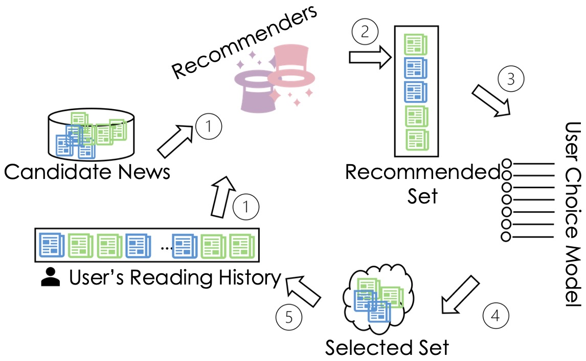

# Rewriting Bias: Mitigating Media Bias in News Recommender Systems through Automated Rewriting

## Overview:

This repository contains the source code and data for the paper titled "Rewriting Bias: Mitigating Media Bias in News Recommender Systems through Automated Rewriting".
This work examines the potential of automated sentence rewriting methods to mitigate media bias dissemination in news recommender systems.


## Dataset

## Sentence Rewriting Methods

- Sentence Rewriting Using LLMs 
    - The source code is under RewritingSentences folder
- Sentence Rewriting Using Word Replacement
    - The code based on https://github.com/ruanqin0706/MediaBiasinNews
    

## Integration of Rewritten News Headlines in News Recommender Systems

In our research, we integrate rewritten news headlines into news recommender systems to mitigate media bias dissemination. 
The typical recommendation process is illustrated as below: 


    

which involves multiple stages where news items are selected and recommended to users based on their reading history. 
Our work focuses on injecting rewritten news headlines at three places in this process: the user's reading history, the candidate set, and the recommendation algorithms themselves.

- **U**: User's Reading History
- **C**: Candidate News Set
- **A**: Recommendation Algorithms

By combining these three places, we have seven scenarios:

- **User History Integration (U)**: Sentence rewriting is applied to the users’ reading histories.
- **Candidate News Dataset Integration (C)**: Sentence rewriting is only applied to the candidate news items.
- **Dual Integration (UC)**: Sentence rewriting is applied to both user reading histories and candidate news items.
- **Algorithms Trained on Rewritten News (A)**: Recommendation algorithms are trained using data with rewritten sentences.
- **Algorithms Trained on Rewritten News with User History Integration (UA)**: Sentence rewriting is applied to training data and user reading histories.
- **Algorithms Trained on Rewritten News with Candidate News Dataset Integration (CA)**: Sentence rewriting is applied to training data and candidate news items.
- **Algorithms Trained on Rewritten News with Dual Integration (UCA)**: Sentence rewriting is applied to training data, user reading histories, and candidate news items.

### Implementation

The source code is under MediaBiasDissemination folder. To run our experiments, you can use the following command with your specific parameters: 

```bash
nohup bash rec_plm.sh \
    {result_folder} \
    {candidate_news_mode} \
    {news_candidate_strategy} \
    {device_no} \
    {top_k} \ 
    {selected_n} \
    {strategy} \ 
    {step_file} \ 
    {model_path} \
    {simulation_code_dir} \
    {data_root_dir} \
    {apply_mode} \ 
    {apply_news_path} > {log_file} &
```

Parameter Descriptions:

1. {result_folder}: Path to the folder where results will be saved.
2. {candidate_news_mode}: Mode for generating candidate news format. `ul` for FIM and PLM-empowered; `l` for NRMS.
3. {news_candidate_strategy}: Strategy for news candidate. Select from `dynamic` or `fixed`.
4. {device_no}: GPU device number. Example: `0` (for GPU)
5. {top_k}: Value for `top_k`.
6. {selected_n}: Value for selected `n`. `n` must smaller than `top_k`
7. {strategy}: User Choice strategy value. Between `1` to `7`
8. {step_file}: Path to the file containing iteration numbers. Example: `/path/to/step65.txt`
9. {model_path}: Path to the model weights file. 
10. {simulation_code_dir}: Path to the simulation code directory.
11. {data_root_dir}: Path to the data root directory.
12. {apply_mode}: Patterns of applying sentence rewriting methods in recommendation systems. 
                  Select from `apply_none`, `apply_hist`, `apply_candidate` or `apply_both`.
13. {apply_news_path}: Path to the apply news file (used if apply_mode is `apply_hist` or `apply_candidate`).
14. {log_file}: Path to the log file.

#### Examples
We have included all commands we used for running scenarios U, C, UC, A, UA, CA, UCA in `MediaBiasDissemination/fim`, `MediaBiasDissemination/nrms`, `MediaBiasDissemination/plm`.  


## Citation
If you use this code or the techniques presented in our research, please cite our paper as follows:

```bibtex
@inproceedings{ruan2024rewriting,
title={Rewriting Bias: Mitigating Media Bias in News Recommender Systems through Automated Rewriting},
author={Qin Ruan, Jin Xu, Susan Leavy, Brian Mac Namee, and Ruihai Dong},
booktitle={Proceedings of the 32nd ACM Conference on User Modeling, Adaptation and Personalization (UMAP '24)},
pages={1--11},
year={2024},
organization={ACM},
address = {New York, NY, USA},
doi = {https://doi.org/10.1145/3627043.3659541}
}
```

## Contact
For any queries regarding the code or research, please contact:

- Qin Ruan - <qin.ruan@ucdconnect.ie> 

